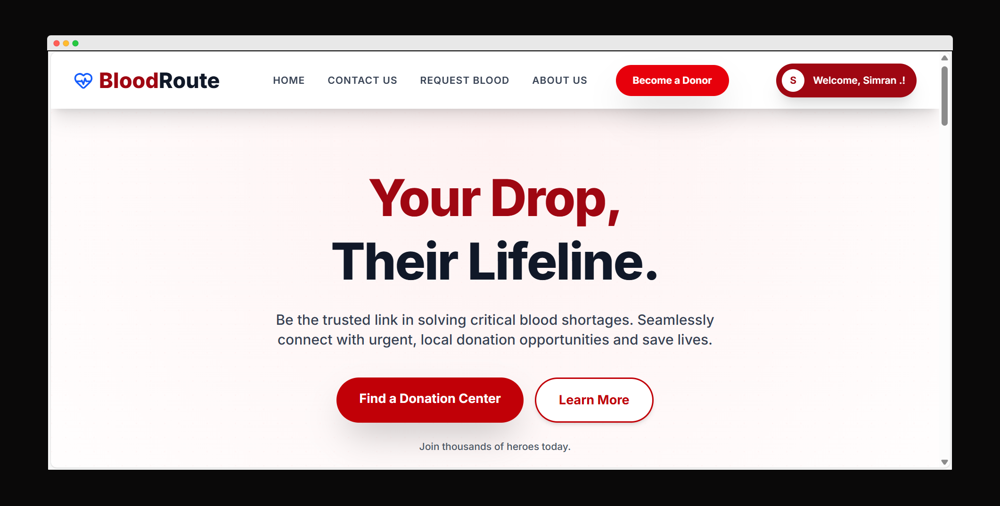
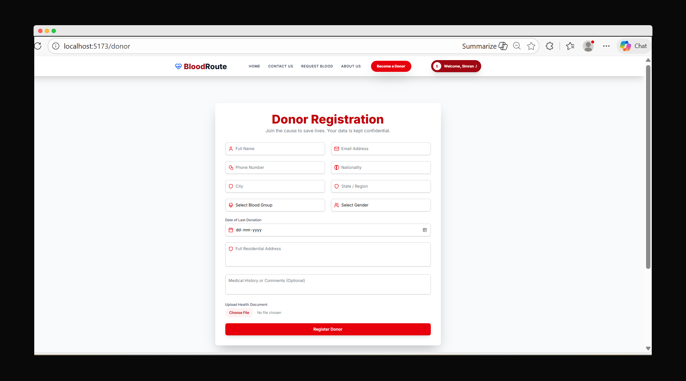
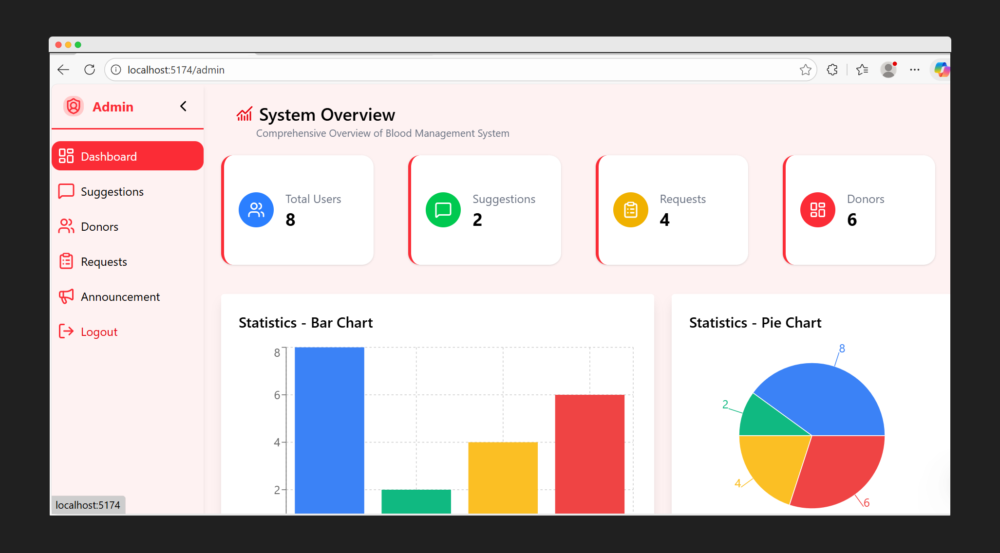
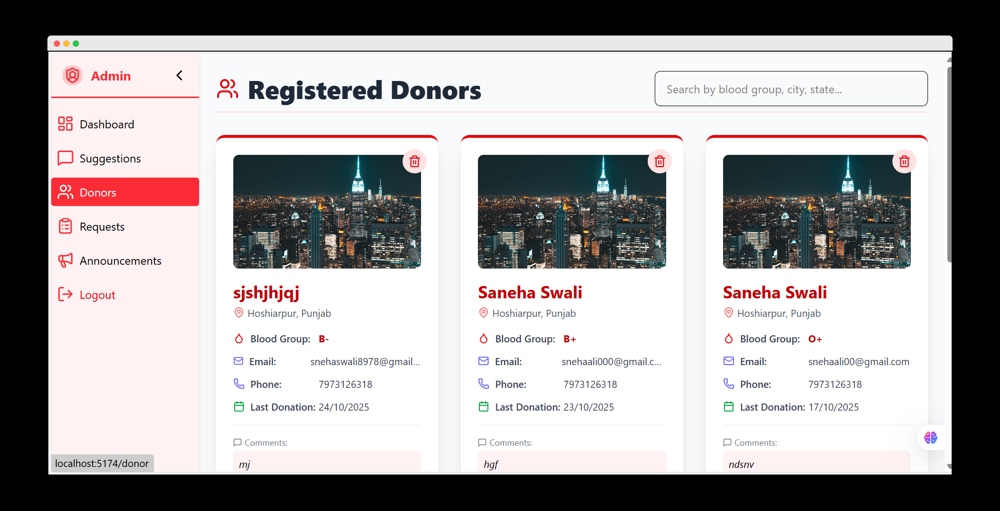
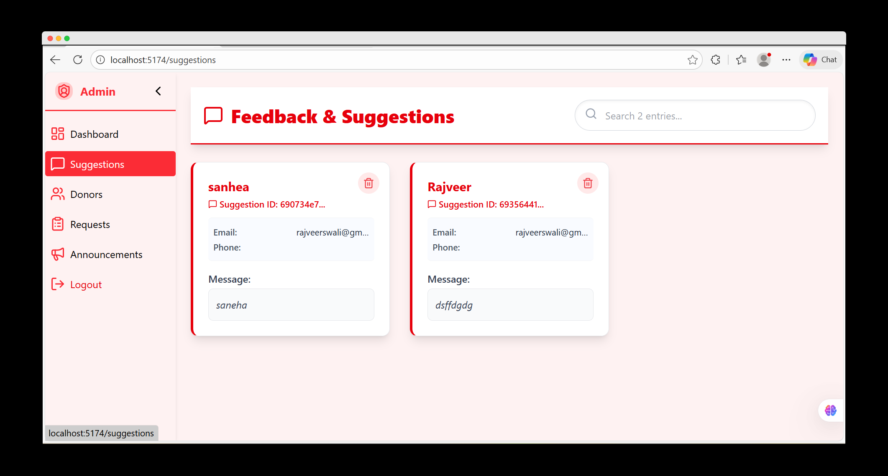

<div align="center">

# 🫀 BloodRoute

### Together we save lives through blood donation

_Donate blood. Save lives._

---

📅 **Review the assignment due date**

---

## 🛠️ Tech-Stack


---

[Features](#features) • [Demo](#demo) • [Installation](#installation) • [Documentation](#documentation) • [Contributing](#contributing)

</div>
## ❓ Table of Contents

- 🌟 [Overview](#-overview)
- ✨ [Key Features](#-key-features)
- 🛠️ [Tech-Stack](#-tech-stack)
- 🖼️ [Screenshots](#screenshots)
- 🚀 [Installation](#-installation--setup)
- ⚙️ [Environment Setup](#-environment-setup)
- 📁 [Project Structure](#-project-structure)
- 📄 [License](#-license)
- 🙏 [Acknowledgments](#-acknowledgements)

---

## 🌟 Overview

The Blood Donor Management System is a life-saving platform designed to connect blood donors with patients and hospitals in real time. Built using modern web technologies, it ensures quick access to blood during emergencies while maintaining transparency, reliability, and ease of use.

---

### 🎯 The Problem We Solve

| ❌ Traditional Blood Donation Systems  | ✅ Blood Donor Management System         |
| -------------------------------------- | ---------------------------------------- |
| 📞 Phone calls and manual coordination | 📱 Online donor–patient matching         |
| 📒 Paper-based donor records           | ☁️ Centralized cloud-based database      |
| ❌ No real-time donor availability     | ⏱️ Real-time donor availability tracking |
| ⌛ Delayed emergency response          | 🚨 Instant emergency blood requests      |
| 🔍 Difficult to find nearby donors     | 📍 Location-based donor search           |
| 🔐 Lack of data privacy                | 🔐 Secure donor information management   |
| 🧾 Manual verification of donors       | ✅ Verified and trusted donor profiles   |

---

### ❤️ Why Choose Our Platform?

**Fast • Reliable • Secure • Life-Saving • Community-Driven**

---

## ✨ Key Features

### 🩸 For Users (Donors & Patients)

| 📝 Donor & Request Management | 📍 Search & Tracking        | 👤 Account Management    |
| ----------------------------- | --------------------------- | ------------------------ |
| 🩸 Register as a blood donor  | 🔍 Find nearby donors       | 🔐 Secure authentication |
| 📋 Create blood requests      | 📍 Location-based search    | 👤 Profile management    |
| 🧾 Select blood group         | ⏱️ Real-time availability   | 🔑 Password updates      |
| 🚨 Mark emergency requests    | 📊 Request status tracking  | 🗑️ Account deletion      |
| 📱 Mobile-friendly design     | 📜 Donation/request history | 📈 Activity overview     |

---

### 🏥 For Hospitals & Administrators

| 🛠️ Admin Controls           | 📊 Monitoring & Analytics | ✅ Verification & Security |
| --------------------------- | ------------------------- | -------------------------- |
| 🧑‍⚕️ Manage donors & requests | 📈 Blood demand analytics | 🪪 Donor verification       |
| 🚑 Handle emergency cases   | 📍 Area-wise availability | 🏥 Hospital verification   |
| 🔄 Update request status    | 🕒 Response time tracking | 🔐 Data privacy control    |
| 🗂️ Maintain records         | 📋 System reports         | 🚫 Remove fake accounts    |

---

### ❤️ Why Choose This Platform?

**Fast • Reliable • Secure • Life-Saving • Community-Driven**

---

## 🛠️ Tech-Stack

## 🎨 Frontend Arsenal

| Technology      | Version | Purpose                              |
| --------------- | ------- | ------------------------------------ |
| ⚛️ React        | 19.1.1  | UI Framework                         |
| 🔁 React Router | 7.9.3   | Navigation                           |
| 🗺️ Leaflet      | 5.0.0   | Heat Maps                            |
| 💡Lucide React  | 0.561.0 | Icons                                |
| 📝 React Hooks  | 7.65.0  | Form Management and state management |
| ⚡ Vite         | 7.1.7   | Build Tool                           |

---

## ⚡ Backend Powerhouse

| Technology    | Version | Purpose       |
| ------------- | ------- | ------------- |
| 🟢 Node.js    | 18+     | Runtime       |
| 🚀 Express    | 4.18.2  | Web Framework |
| 🍃 MongoDB    | 8.0.0   | Database      |
| 🧬 Mongoose   | Latest  | ODM           |
| ☁️ Cloudinary | 2.0.0   | Media Storage |

---

# screenshots

## 🚀 BloodRoute – Application Screenshots

### 🖥️ Key Interfaces Overview

| Landing Page                                                                                       | User Dashboard                                                                                           |
| -------------------------------------------------------------------------------------------------- | -------------------------------------------------------------------------------------------------------- |
|                                                            |                                                         |
| _A platform that connects donors with those in need, making blood donation simple and life-saving_ | _A personalized dashboard where users can view and manage their blood requests and donation activities._ |

| Make Request                                                                        | Become a Donor                                                                               |
| ----------------------------------------------------------------------------------- | -------------------------------------------------------------------------------------------- |
|                                      |                                                   |
| _A page where users can request blood by providing patient and requirement details_ | _Enables users to enroll as blood donors and make themselves available for future requests._ |

## 📸 Admin Interface Screenshots

| **Admin Dashboard**                            | **Make Request of Blood**                       |
| ---------------------------------------------- | ----------------------------------------------- |
|  |  |
| Secure admin authentication page               | Overview of system statistics and controls      |

| **Manage Donors**                       | **Suggestions**                             |
| --------------------------------------- | ------------------------------------------- |
|   |  |
| View, edit, and manage registered users | Manage donor records and availability       |

## 🚀 Installation & Setup

### Step 1️⃣ : Clone the Repository

```bash
git clone https://github.com/your-username/your-repository-name.git
cd your-repository-name
```

## Step 2️⃣ : Backend Setup

```bash
# Navigate to backend directory
cd backend

# Install dependencies
npm install

# Create environment file
cp .env.example .env

# Edit .env with your credentials (see Environment Setup section)
```

Step 3️⃣ : Frontend Setup

```bash
# Navigate to frontend directory (from project root)
cd ../frontend

# Install dependencies
npm install

# Create environment file
cp .env.example .env.local

# Edit .env.local with your credentials (see Environment Setup section)
```

```bash cd backend
npm run dev
# Server runs on http://localhost:5000
```

Step 4️⃣ : Start the Application

# Open two terminal windows:

## Terminal 1 - Backend Server

```bash
cd backend
npm run dev
# Server runs on http://localhost:5000
```

## Terminal 2 - Frontend Development Server

```bash
cd frontend
npm run dev
# Application opens on http://localhost:5173
```

## ⚙️ Environment Setup

### Environment Variables

This project requires several environment variables for configuration. **Do not share your actual credentials publicly.** Use the `.env` file in your project root to set these values:

```env
# ==========================
# Cloudinary Configuration
# ==========================
CLOUD_NAME="Your Cloudinary cloud name here"
CLOUD_KEY="Your Cloudinary API key here"
CLOUD_SECRET="Your Cloudinary API secret here"

# ==========================
# JWT Configuration
# ==========================
JWT_SECRET="Your JWT secret key here"

# ==========================
# Server Configuration
# ==========================
PORT=8080                 # Port number for the server

# ==========================
# MongoDB Configuration
# ==========================
mongo_URL="Your MongoDB connection string here"

# ==========================
# Application User Credentials
# ==========================
user_email="Your user email here"
user_pass="Your password here"
```

---

## 📁 Project Structure

```bash
📦 Project Root
│
├── backend/                         # Node.js + Express backend
│   │
│   ├── configs/                     # Configuration files
│   │   └── cloudinary.js            # Cloudinary setup for file uploads
│   │
│   ├── db/                          # Database connection
│   │   └── db.js                    # MongoDB connection logic
│   │
│   ├── controllers/                # Request handling logic
│   │   ├── authController.js        # Authentication (login, signup, OTP)
│   │   ├── findController.js        # Search / find related logic
│   │   ├── getDonorController.js    # Donor-related business logic
│   │   ├── requestController.js     # Blood request logic
│   │   └── suggestionController.js  # Suggestions handling
│   │
│   ├── middlewares/                # Custom middlewares
│   │   ├── authMiddleware.js        # JWT authentication middleware
│   │   ├── multer.js                # File upload middleware
│   │   └── verifyAdmin.js           # Admin authorization check
│   │
│   ├── models/                     # Mongoose schemas
│   │   ├── Announcement.js          # Announcement schema
│   │   ├── Donors.js                # Donor schema
│   │   ├── Requests.js              # Blood request schema
│   │   └── Users.js                 # User schema
│   │
│   ├── routes/                     # API route definitions
│   │   ├── adminroute.js            # Admin-related routes
│   │   ├── announcementroute.js     # Announcement routes
│   │   ├── authRoute.js             # Authentication routes
│   │   ├── changeRequestStatus.js   # Update request status
│   │   ├── deleteDonors.js          # Delete donor routes
│   │   ├── deleteReq.js             # Delete request routes
│   │   ├── deleteSuggestion.js      # Delete suggestion routes
│   │   ├── fetchAdminData.js        # Admin dashboard data
│   │   ├── findDonors.js            # Find donor routes
│   │   ├── getDonors.js             # Fetch donors
│   │   ├── getRequests.js           # Fetch requests
│   │   ├── getSuggestionStatus.js   # Suggestion status routes
│   │   ├── getUsers.js              # Fetch users
│   │   ├── updateProfile.js         # User profile update
│   │   └── uploadRouter.js          # File upload routes
│   │
│   ├── utils/                      # Helper functions
│   │   └── sendOtp.js               # OTP sending utility
│   │
│   ├── .env                        # Environment variables
│   ├── .gitattributes              # Git attributes
│   ├── .gitignore                  # Ignored files
│   ├── index.js                    # Backend entry point
│   └── package.json                # Backend dependencies
│
├── admin-panel/                    # Admin dashboard (React + Vite)
│   │
│   ├── public/                     # Static assets
│   ├── src/
│   │   ├── components/             # Reusable admin components
│   │   │   ├── AdminNavbar.jsx
│   │   │   └── Sidebar.jsx
│   │   │
│   │   ├── Pages/                  # Admin pages
│   │   │   ├── Admin.jsx
│   │   │   ├── AdminProtected.jsx
│   │   │   ├── Announcement.jsx
│   │   │   ├── Donors.jsx
│   │   │   ├── Login.jsx
│   │   │   ├── ProtectedAdmin.jsx
│   │   │   ├── Request.jsx
│   │   │   ├── Suggestions.jsx
│   │   │   └── UserAnnouncement.jsx
│   │   │
│   │   ├── App.jsx                 # Main app component
│   │   ├── main.jsx                # React DOM entry
│   │   ├── index.css               # Global styles
│   │   └── Utils.jsx               # Utility functions
│   │
│   ├── index.html                  # HTML template
│   ├── package.json                # Admin panel dependencies
│   └── vite.config.js              # Vite configuration
│
├── frontend/                       # User-facing frontend (React + Vite)
│   │
│   ├── public/                     # Static assets
│   ├── src/
│   │   ├── assets/                 # Images, icons, etc.
│   │   │
│   │   ├── components/             # Reusable UI components
│   │   │   ├── Admin.jsx
│   │   │   ├── Footer.jsx
│   │   │   ├── HomeButton.jsx
│   │   │   ├── NavBar.jsx
│   │   │   └── Profile.jsx
│   │   │
│   │   ├── Pages/                  # Application pages
│   │   │   ├── Aboutus.jsx
│   │   │   ├── Admin.jsx
│   │   │   ├── AdminProtected.jsx
│   │   │   ├── Announcements.jsx
│   │   │   ├── ContactUs.jsx
│   │   │   ├── Dashboard.jsx
│   │   │   ├── Donor.jsx
│   │   │   ├── Home.jsx
│   │   │   ├── Login.jsx
│   │   │   ├── ProtectedRoute.jsx
│   │   │   ├── RequestBlood.jsx
│   │   │   ├── SideBar.jsx
│   │   │   ├── SignUp.jsx
│   │   │   └── VerifyOtp.jsx
│   │   │
│   │   ├── Utils/                  # Helper utilities
│   │   │   └── Utils.jsx
│   │   │
│   │   ├── App.jsx                 # Main app component
│   │   ├── main.jsx                # React DOM entry
│   │   └── index.css               # Global styles
│   │
│   ├── index.html                  # HTML template
│   ├── package.json                # Frontend dependencies
│   └── vite.config.js              # Vite configuration
│
└── README.md                       # Project documentation
```

---

## 📄 License

(Add license info)

---

## 👥 Team BloodRoute

**Rayat Bahra Professional University**  
_Blood Donor Management System_

---

### 🔗 Project Links

[](https://github.com/your-repo-link)
[](https://your-report-link)
[](https://github.com/your-repo-link/issues)
[](#)
[](https://github.com/your-repo-link/discussions)

---

## 💬 Get in Touch

Have questions or suggestions? We'd love to hear from you!

- 📧 **Email:** [Contact Us](mailto:your-email@example.com)
- 🐞 **Found a Bug?** [Report it here](https://github.com/your-repo-link/issues)
- 💡 **Have an Idea?** [Start a discussion](https://github.com/your-repo-link/discussions)

---

## 🙏 Acknowledgements

### 🌟 Special Thanks

| Category               | Name                                | Description                                                                  |
| ---------------------- | ----------------------------------- | ---------------------------------------------------------------------------- |
| 🏛️ Institution         | Rayat Bahra Professional University | For providing me a platform ,where i learnt new technical skills             |
| 🛠️ Technology Partners | MongoDb,Vite                        | For providing reliable services that power the Blood Donor Management System |
| 🌐 Open Source         | React, Node.js, Express             | For the powerful frameworks and libraries used in development                |

---

### 💐 Additional Thanks

| Resource                    | Purpose                                        |
| --------------------------- | ---------------------------------------------- |
| 🗺️ Google Maps API          | Location-based donor and request search        |
| 📚 Stack Overflow Community | Problem-solving and developer support          |
| 💻 GitHub Community         | Open-source collaboration and inspiration      |
| 🎓 Mentors                  | Guidance and valuable feedback                 |
| 👥 Contributors             | Teamwork and project development               |
| ⭐ Supporters               | Everyone who starred and supported the project |

---

## ❤️ Thank You

Thank you for checking out the **Blood Donor Management System**.

This project aims to save lives by efficiently connecting blood donors with patients in need.  
Every contribution, feedback, and star helps us improve and expand this life-saving platform.

---

**Made with ❤️ by Saneha**  
_Rayat Bahra Professional University_

---
